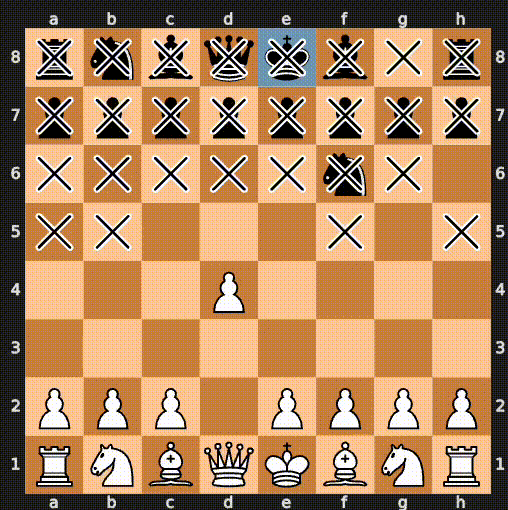
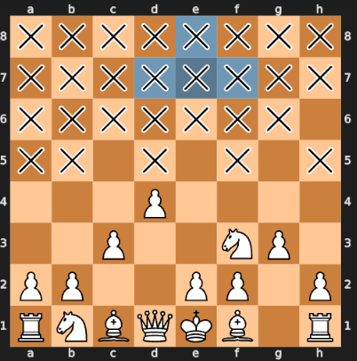
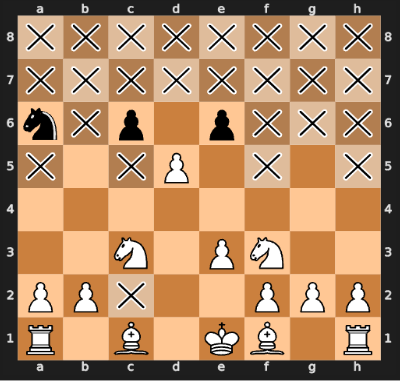

William Ermlick CS695 Fall 2023
# Introduction (Motivation) and Related Work: 
Proposed in 1989, Dark Chess hit the mainstream through Chess.com amidst the pandemic and 
chess boom in 2021. The variation turns chess into an 
imperfect information game, where players are only allowed to view their opponent’s pieces 
which are on squares accessible to their own pieces. This changes the games dynamic to 
encourage making moves purely for exploration purposes, instead of traditional aims like 
controlling squares or pressuring weaknesses.

Dark Chess is a difficult problem. The state space in chess is very large and in dark chess
the majority of the state space is unobserved at each moment in the game. This leads to 
a dimensionality explosion that makes many traditional approaches, like Monte Carlo Tree Search, 
not very effective on their own. 

Solvers for partially observable markov decision processes (POMDPs) are either done offline by 
precomputing all possible belief space trees or online, where trees are continually built each move of the game.
For Dark chess, online solvers are the only option as building a complete tree is computationally infeasible.

Partially observable chess is also in general an recent area of research. The [international competition on blind chess](https://proceedings.mlr.press/v123/gardner20a/gardner20a.pdf) is similar to dark chess, where players cannot see opponent pieces but instead take explicit sensing actions to find them. A fairly robust development platform is available to play and develop bots for this variant [online](https://reconchess.readthedocs.io/en/latest/ranked.html).

While a variant for dark chess is available for online play through [chess.com](https://www.chess.com/variants/fog-of-war), there are no decently 
performing engines to play against that are readily accessible, and more generally there are no open source resources on building
dark chess bots. This repo will hopefully allow others to make similar kinds of bots and to play against them, while learning about POMDPs.

## Additional Relevant Academic Papers 
There have been a few papers that have looked to tackle Dark Chess in particular that form the state of the art in the field. Once such paper is [subgame solving](https://proceedings.neurips.cc/paper/2021/file/c96c08f8bb7960e11a1239352a479053-Paper.pdf) which breaks the game down into compartamentalized problems. This paper produces an agent of around 2000 elo against relative to two human player. Another Dark Chess specific paper uses [importance sampling to minimize counter factural regret](https://www.mit.edu/~gfarina/2023/escher_iclr23/2206.04122.pdf). This paper has a deep mathematical basis but presents results in Figure 1 that only barely show their model beating a random agent, something that was easy to achieve in this tutorial, which open questions. Not directly relevant to Dark Chess, but related papers include the [DeepNash paper](https://www.science.org/stoken/author-tokens/ST-887/full) used to beat the game Stratego could be extended to the game of Dark Chess, as the two game share many characterisitics and the new [beta zero solver](https://arxiv.org/pdf/2306.00249.pdf) which applies the principles of MuZero to POMDPs and is currently ported to the [Julia POMDP toolkit](https://github.com/JuliaPOMDP/POMDPs.jl). 

Two more mainstream papers that could be natural extensions to where this tutorial will leave off include the [POMCP algorithm](https://www.davidsilver.uk/wp-content/uploads/2020/03/pomcp.pdf) and the [DESPOT algorithm](https://www.comp.nus.edu.sg/~leews/publications/nips2013somani.pdf). These papers describe methods of simulated traversal of belief states trees and backpropogating the results of those simulations to make present decisions. Despot is particular relevant to Dark Chess as it eliminates many of the branches to be considered.

# Tutorial Details
This tutorial walks through building few dark chess bots and a custom environment for evaluating bot performance and building additional bots.

||
|:--:| 
| *PBSA v. UBSA* |

## Description/Theory of Created Agents:
* <u>**Random Agent**</u>: This agent is a baseline agent that simple made a random legal move in every position.
* <u>**Greedy Agent**</u>: An agent that takes the highest valued piece that is available for capture. The current position is checked for available captures, if the user can capture the opponents king that capture is immediately made, if not all captures are considered and the piece values of the proposed captured pieces are compared until the best capture is found. If a capture is not available the agent makes a random move. 
     * <u>Conservative Variant</u>: The agent will not take a piece if it is worth less than the piece they would take it with.
     * <u>Preservative Variant</u>: The agent will more strongly consider taking a piece if the piece they would take it with is currently under attack.
* <u>**Uniform (Belief State) Estimator Agent (UBSA)**</u>: Particle filter type agent with a uniform belief space for unseen parts of the board that only simulates for the current belief state. The agent keeps track of all pieces that have been captured and attempts to uniformly estimate their positions within the unseen squares of the board. A belief state tensor (8x8x23) is created which encodes the probability that an opponent piece of a certain type is on a certain square. This belief state tensor is created at the start of each of the agents turns based on what the agent currently observes and is then sampled to generate various possible board states. These possible board states are used to determine what move the agent will make. 
     * <u>Well Performing Variant</u>: Stockfish is run on each potential board state to find the best move in each position. The most common move across all of the simulated boards is then selected as the agents move. If there is no unaimous move, then a greedy agent move is selected. 
     * <u>Random Stock Fish Move</u>: Only a single board state is sampled and the best StockFish move in this position is chosen if there is no greedy move.
     * <u>Stockfish evaluating multiple boards (effective but far too slow)</u>: Top N moves from each sampled board are found by StockFish. These moves are then evaluated across all sampled boards using StockFish and the mean evaluation saved. The best performing move on average is chosen by the agent.
* <u>**Progressive (Belief State) Estimator Agent (PBSA)**</u>: Particle filter type agent with an updating belief space for unseen parts of the board that only simulates for the current belief state. This agent updates their belief state based on each observation that they acquire. The agent simulates what action the opponent took by sampling many potential board states based on the current belief state and having the opponent play a random move (and a greedy move some percentage of the time) on each of the simulated board. Those final positions of the opponent pieces in each of the simulated board are then used as the belief state tensor by taking their average and then softmax across all piece type layers (ignoring pieces that we already see the position of, of course). Any direct observations of pieces after the agents move are used to overwrite the current belief state. If the agent observes the opponents piece that moves, simulation is not performed, instead the newly observed squares are simply overwritten and the unseen squares for the opponent piece type that moved are decremented to allow for uncertainty (this can be improved by backtracking how the currently observed move is possible but was presently done due to time constraints). Once the new belief states is acquired, a move is chosen in the same way as the UBSA agent.    
* <u>**POMCP Agent (Incomplete)**</u>: This agent was started but was not completed. The plan was to incorporate the belief state updates into a monte carlo type tree search based on the POMCP paper, using StockFish to evaluate the rollouts instead of simulation. After writing much of the code I realized I did not have the mechanics in place to update the belief state which sent me down the path of implementing  PBSA. Now that PBSA is implemented, much of the code could be ported over, with some additional thought given to handing the observations as they are a little different than the original paper.

## Evaluation
Evaluation of these agents was done by comparing their head to head performance against (1) the random agent, but (2) each other agent where reasonable. The assessments were conducted over as many games that could be run within time constraints and to establish a reliable estimate of win percentage. ELO computations amongst the bots can also be computed, assuming one of the bots has a fixed level of play (say 400 for the random bot. The formula for the elo calculations is provided below. This metric will assess 
the likelyhood that one player will beat be the other player in the long run.
Performance rating= opponent_rating+400* (Wins - Losses)/Games

## Results 
* Random Agent v. Greedy Agent → Greedy agent wins 99.8% out of 1k games tested
* UBSA v. Greedy Agent → UBSA wins 70% of 100 games
* PBSA v. Greedy Agent → PBSA wins 93% of games of 50 games
* PBSA v. UBSA → PBSA wins 77% of 20 games

Other Results
* Greedy Agent - Conservative V Greedy Agent  → Greedy Agent wins 70% of 1k games
* Greedy Agent - Preservative V Greedy Agent  → Greedy Agent wins 51% of 1k games
* The other UBSA and PBSA variants were too slow to evaluate in a large enough sample of games

## Results/Discussion
Generally, the better designed agent won. It was generally interesting how StockFish did help make agents make moves that increased their vision and kept pieces protected but also made moves that were clearly not the best for dark chess. StockFish generally lacks the aggression that is needed in a king capture type chess variant and only attempts to hunt down the enemy king when a check makes sense in a traditional game. This leads to long, drawn out games in endgames (not very many major pieces like queens and rooks on the board) when the best move in darkchess is most likely to find and destroy the king. Additionally, suicidal moves where a queen will randomly go off and grab an opponents piece without first scouting what was protecting that piece continued to happen even in the PBSA agent. This is likely due to the lack of simulations showing that the piece could have been defended and also based upon the "well performing variant" strategy which calls for picking a consensus move across all possible boards, where likely the piece is undefended much of the time. Another interesting observation is that when the conservative greedy agent plays against the regular greedy agent they lose around 70% of the time. This is because the greedy agent takes advantage of the timidness of the conservative variant and takes pieces when they are in a standoff. This can lead to an enemy bishop entering the opponent position and the conservative agent is afraid to take with it's queen or other major pieces it because is not worth as much.

||
|:--:| 
| *PBSA belief visualization of the King* |

||
|:--:| 
| *UBSA belief visualization of the King* |

A video of an example game between PBSA and UBSA is provided in the media folder. These visualizations can be created/seen in the `demo.ipynb` notebook. Example belief space visualizations can also be found in the media folder and likewise created by running the PBSA and UBSA agents with `color_of_belief_state_to_watch` and `piece_of_belief_state_to_watch` set. Notice how UBSA has a uniform distribution over all unseen squares for the king positions, whereas PBSA has a more realistic estimation which is based on sampling moves from sample board states. Additionally, PBSA only updates when they do not see the opponents move and it is possible they moved the king.

## Getting Started
A development container is provided along with a poetry lock file for installing all required dependencies. If you decide against using the Dockerfile, you will need to install stockfish on your machine and edit the stockfish path initalizer in line 399 of `agents/utils`. 

* Install and run [docker desktop](https://docs.docker.com/get-docker/)

* Open this repository in VS code and install the dev containers extension

* A popup should come up which requests you to reopen the current workspace in a development container, accept it. This will build the container and attach VS to the container.

* Poetry should automatically install the dependencies within the container. If not use `poetry install` to install them. 

* The virtual environment should be up and running, as well as the jupyter notebook VS code extension. You can open `demo.ipnb` and get started viewing different agents.

* If you do not want to use a .dev container you can pip install the requirements via the requirements.txt file into a virtual environment that has python3.11-13 or use the poetry.lock file directly if you have poetry installed and the right python version locally. You could also build and run the docker-compose file using `docker-compose build dev` followed by `docker-compose run dev` from the .devcontainer folder, but this will not allow you to view the jupyter notebook demos without attaching VS code to the docker container via the docker extension.

## Breaking down the repo
I wrote the code that lives in the agents folder. The main demo and run code is in `demo.ipynb` and `run_game.py`. The demo notebook will allow you to watch agents play eachother, keep track of scoring, and allow you to visualize the current belief state of particular agents as they play.

This includes all of the agent code and the `utils.py` file that includes code for converting from pyspeil.State to python-chess.Board to numpy.ndarray belief/state tensors. These conversions and the particular tensor format that stores the game state was inspired from the way chess state was stored in the alpha zero implementation and were particularly difficult to keep track of as the game progresses. What makes this difficult is that the order AND orientation of the tensor varies depending on the active player. This means that if it is white's turn layers 0-5 describe white piece position and 6-12 describe blacks. However, on blacks turn 0-5 now describe blacks pieces and 6-12 describe whites, and these layers are rotated and rolled from the previous board state. This becomes increasingly difficult in the PBSA when the agent needs to make observations when it is not their turn anymore based on the pyspeil state. These state tensors were made to track belief state probabilities which was not feasible in OpenSpiel. `python-chess` was used to handle creating boards that had the rules of chess so I did not have to create those capture type checks by hand in tensor space. Conversion between pyspeil, python-chess, and numpy arrays takes place mainly in the `utils.py` file and was essential for getting the project to work.

The various agents have the same interface and it should be straight forward to create another. The main functions to implement are `find_move` and `get_observation_after_move`, perhaps easiest to see in the random agent.

`darkchess_viz_wrapper` contains code for rendering the board state based on viewpoint. This was created early on in the project and could likely be supplanted by the code in `utils.py` which now stores the full belief/board state tensor, including which squares the active player sees in layer 23.

`failed_environments` is OBE at this point and includes several old environment that I tried out at the start of the project that did not end up working out. Some did not properly implement dark chess (e.g., no stalemate, no pawn promotion) and others were just too difficult to use. It also incldues some homework code and some board encodings used by alpha zero.

# Future Work
* Determine possible belief state based on a belief state neural network that has been trained through self play -- this could also be based on a history of states
* Finish POMCP implementation -- perform tree searches to not just plan for current moves, but several moves ahead in the tree
* Despot -- similar to above but prune the tree search to only consider a few best branches
* Some of the major bottlenecks with the current code revolve around StockFish being slow and crashing. If StockFish crashes the thread is difficult to recover from and has to be killed. Since stockfish is slow, multiprocessing the state evaluations would greatly speed up the current bots. 
* There are minor errors with the belief state update that should be tracked down and tests written for
* It would be nice if pyspeil kept track of belief state tensor in C++ to avoid all the conversions

# Failed implementations
* I tried https://github.com/genyrosk/gym-chess/issues but it was buggy (no stalemate, no promotion, no gui, and had open pull requests)
* Also tried  https://github.com/vishalsubbiah/darkchess/blob/master/darkchess/src/darkboard.py but it had similar issues 

* open spiel had darkchess -- but their observation tensors had no documentation and was improperly implemented therefore had to write my own using a combination of python-chess and the darkchess.cc file for proper mechanics

# Resources 
* https://www.davidsilver.uk/wp-content/uploads/2020/03/pomcp.pdf - pomcp
* https://www.comp.nus.edu.sg/~leews/publications/nips2013somani.pdf - despot
* https://github.com/AdaCompNUS/despot#documentation - despot c++ implementation

* https://github.com/official-stockfish/Stockfish/wiki/UCI-&-Commands - stockfish settings
* https://python-chess.readthedocs.io/en/latest/ - python chess
* https://github.com/google-deepmind/open_spiel - open speil - darkchess - https://github.com/google-deepmind/open_spiel/tree/master/open_spiel/games/dark_chess

* SOTA approaches
* https://proceedings.neurips.cc/paper/2021/file/c96c08f8bb7960e11a1239352a479053-Paper.pdf
* https://www.mit.edu/~gfarina/2023/escher_iclr23/2206.04122.pdf 
* https://www.science.org/stoken/author-tokens/ST-887/full  stratego deep nash
* https://arxiv.org/pdf/2306.00249.pdf -- beta zero
* https://github.com/JuliaPOMDP/POMDPs.jl -- jula pomdp solver

* recon chess
* https://proceedings.mlr.press/v123/gardner20a
* https://proceedings.mlr.press/v123/gardner20a/gardner20a.pdf 
* https://reconchess.readthedocs.io/en/latest/ranked.html